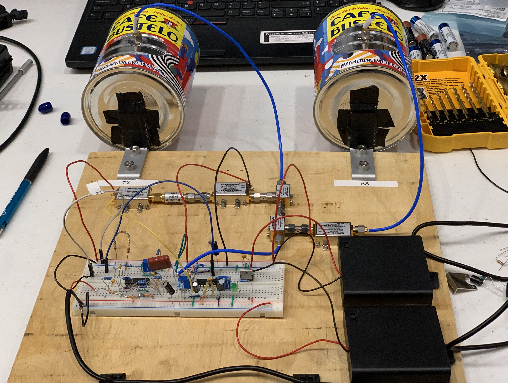

# Building a Coffee Can Radar

#### 21 Jul 2019

Recently [the company where I work](https://carnegierobotics.com/) had an employ hackathon. The only rule was that every project had to incorporate a Jetson Nano in some way. After brainstorming for a while I got together with two other engineers, and we decided to build a synthetic aperture radar system using coffee cans as antennas. This is a well known idea from a [MIT open courseware class](https://ocw.mit.edu/resources/res-ll-003-build-a-small-radar-system-capable-of-sensing-range-doppler-and-synthetic-aperture-radar-imaging-january-iap-2011/) and talked about on a few blogs like [Hackaday](https://hackaday.com/2014/03/17/radar-imaging-in-your-garage-synthetic-aperture-radar/). We figured with all this documentation how hard would it be to get it working in thirty-six hours?

First a word of warning about budget to anyone who wants to try this project. Mini-circuits has raised its prices considerably since the MIT course came out. They estimated the price of material to be around \$350, we spent closer to \$500 (not including the Jetson) when all was said and done.

At the start of the hackathon our team split into two groups. One for hardware and one for software. The MIT course supplied code for the project, but it was written in MATLAB. We decided it was not sporting to just get the MATLAB code to run in Octave on the Jetson. Instead we went about trying to port it into Python with NumPy and SciPy. Converting MATLAB to Python should be straightforward, but the author of that MATLAB code is not going to win any awards for commenting and variable names. One of our team members spent the whole time sifting through it, and was only sort of able to get the correct output from the posted sample data. I will try to get our code up on GitHub soon.

On the hardware front there were two main parts of the project, the RF circuit and the breadboard circuit. The breadboard portion was well documented, but still a little tricky to build. There was a lot going on with a power supply, function generator, and op-amp filter. Like all complicated breadboard work it required a lot of time and attention to detail. We also did not get any part of it right on the first try, and spent a good bit of the hackathon bent over the oscilloscope debugging. The lowest point for me was [soldering jumper wires onto an 0804 capacitor](./coffee-can-radar/expert-soldering.jpg) to get it to fit on the breadboard. I don't remember why we decided that was better than combining through hole.

The RF side went together much easier, but had a fundamental problem. All the RF components just screwed together so building a circuit out of them was like assembling a lego set. The issue came from the coffee can antennas. All antennas (and coffee cans for that matter) are slightly different and need to be tuned for the frequencies you want to work at. You can do the math to get into the right ballpark but at the end of the day you need to connect the antenna to a spectrum analyzer and get tuning. 

This turned into a frustrating lesson in the importance of learning how to use your tools. The theory of what I needed to do was easy, but I could not for the life of me get the spectrum analyzer to do what I wanted. To compound the frustration when I googled for help there were countless videos of people doing what I wanted in a few clicks on simple little analyzers. I was sitting in front of a high end behemoth and was totally clueless. I got help from a senior engineer, and got closer, but evenalty had to give up and move forward with my untuned anteans in the interest of time.

We finally connected the RF and breadboard circuits together and viewed the output on a o-scope. When we walked in front of the anteans with a piece of metal the output clearly changed! This was a big win because it meant something was working. The downside was that the output was in the 0-8V range and we needed it to be 1Vpp so we could connect it to the Jetson through a 3.5mm microphone jack. We considered putting our output through a voltage divider to just get the right levels, but decided that the output being wrong was a sign that something was messed up in our circuity. We tried to figure out what that was, but did not.

At the end of the hackathon we had two separate things: code to interpret the output of the SAR, and a poorly tuned radar setup that doubled as a sweet WiFi jammer. Even though the hackathon is over I still intend to go back and tune the anteans and fix the circuitry. Then we will try to connect the two parts together and generate our own images.

Our project was not technically a success, but it still was for me. First I learned a lot about radar and RF, which was my real goal. We also did build a radar device, even if the only output we could interpret was if we were holding a sheet of metal in front of it. Ontop of that we moved a lot of code from MATLAB to Python which will hopefully make it easier for others to build upon. 