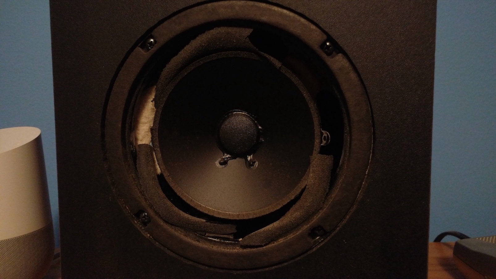
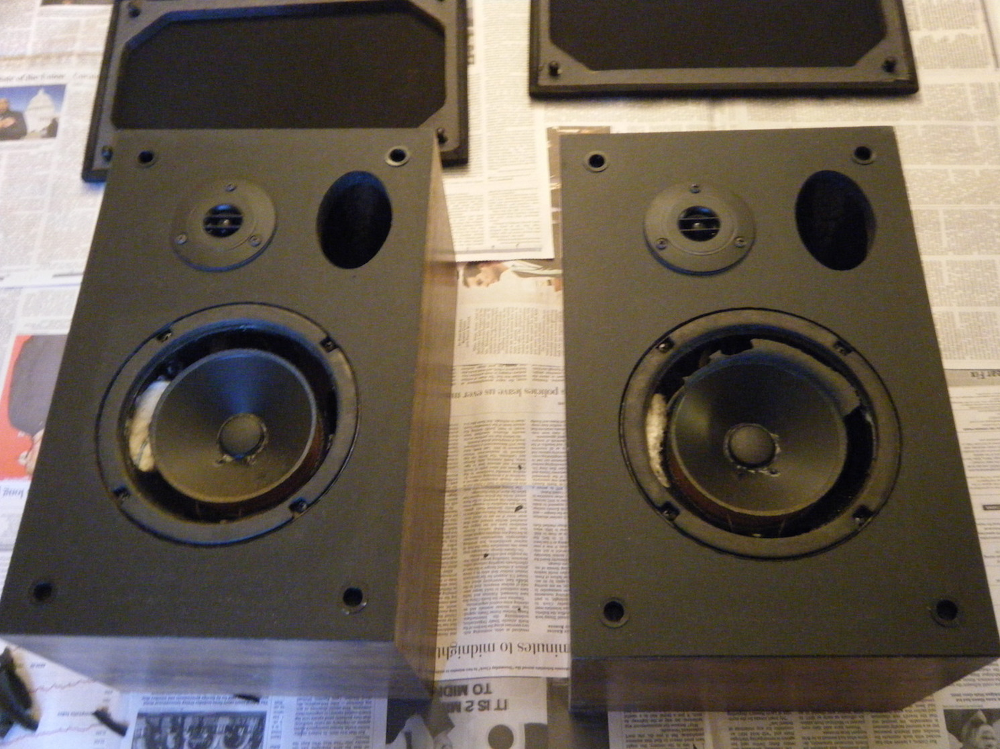
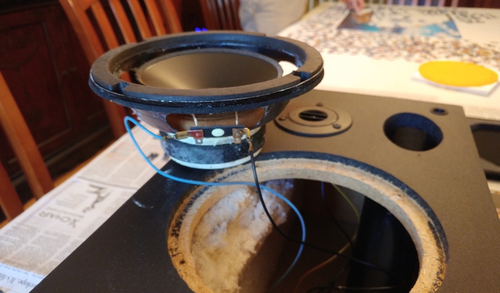
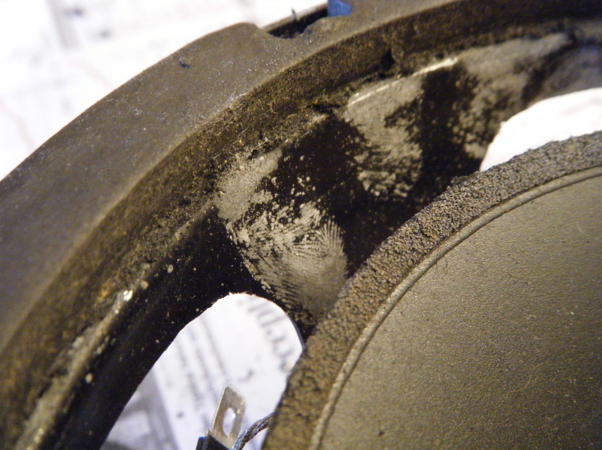
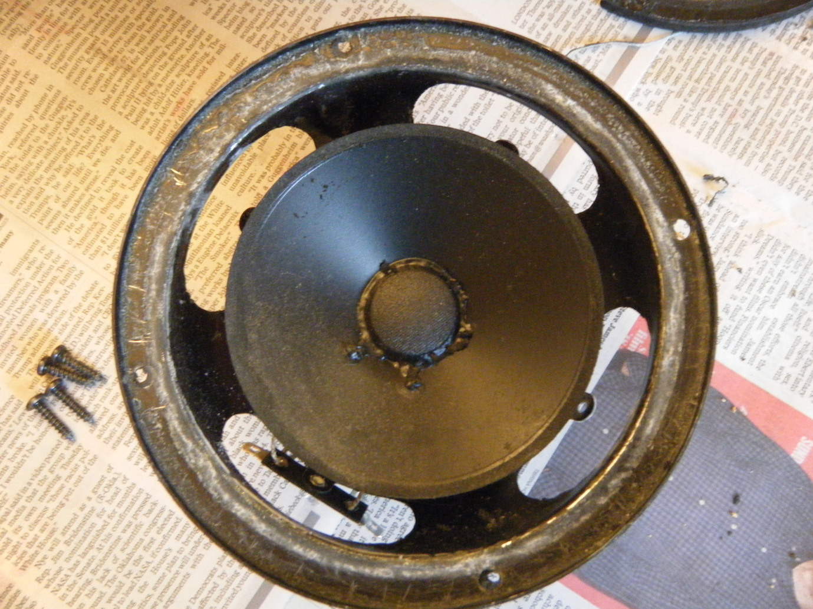
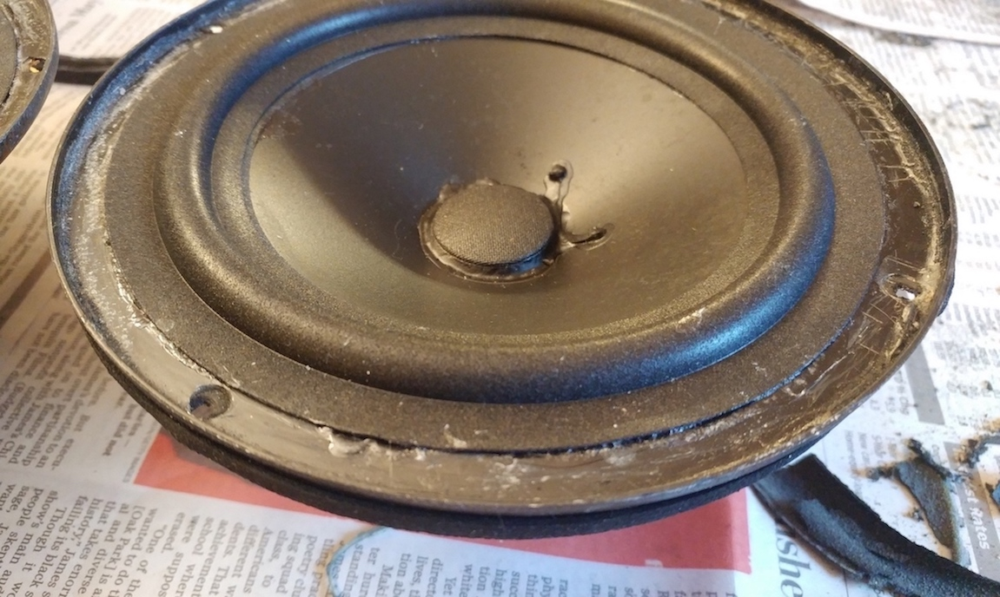
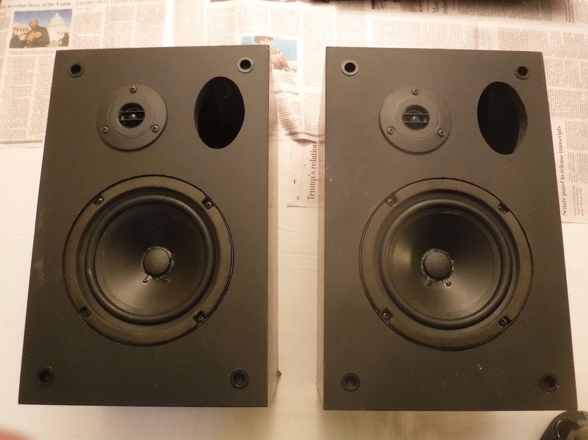

# Pinnacle Speaker Repair

#### 8 Feb 2018

I found an old pair of Pinnacle speakers in the loft above my garage the other day, but they did not look to great.

While foam rott is a very ugly problem, it's not that uncommon in older speakers. The foam surrounding the drivers can just decay over time, and leaves you with something like what you see above. Luckly there are repair kits and [tutorials](http://www.instructables.com/id/re-foam-your-old-speakers/) [all](http://www.decware.com/newsite/refoam.htm) [over the internet](https://www.simplyspeakers.com/speaker-repair-foam-edge-replacement-instructions.html) for fixing this sort of thing, and I though it would be fun to give it a try.

My first step was to get a foam kit. I went with the [6" refoam kit](https://www.simplyspeakers.com/speaker-foam-edge-repair-kit-fsk-6.html#) from Simply Speakers. You can get kits cheaper off [eBay](https://www.ebay.com/sch/i.html?_from=R40&_trksid=p2380057.m570.l1313.TR1.TRC0.A0.H0.Xspeaker+refoam.TRS0&_nkw=speaker+refoam&_sacat=0), but for my first time doing this I wanted to buy from a real store. Also someone on a forum somewhere used this kit on these exact speakers and it worked.

## The Repair

When the foam kit came in I went ahead and removed the drivers from the speaker cabinets.

They came out surprisingly easily, just four screws. They were connected to the crossover with slide connectors, which was nice and saved me some soldering on the reassembly. 

The next step was to get rid of any large pieces of foam still on the drivers. I did this by just pulling it off with my fingers.

After that I carefully removed the gaskets from the front of the drivers using a utility knife. This was slow going, but they eventually came off in one piece. If you're not that luck, you can just buy new ones.

While I was taking the gaskets off I noticed you could see gluey fingerprints on one of the drivers. They are clearly from the person who originally assembled it. This is one of the things I really like about old audio equipment, it feels very handmade and human.

With the gaskets off I began the most time consuming part of the repair, removing the remaining foam. I scraped the foam off of the metal part of the drivers using a chisel. I then used an exacto knife and rubbing alcohol on the cone, and the exacto knife on the bottom side of the gaskets.

Once I got tired of trying to get all the old foam off, I decided the next step was to start glueing on the new foam. This was not as straightforward of a decision as it sounds though.

There seems to be some disagreement on the internet around whether or not you need to remove the dusk caps, and use shims to center the voice coil. The danger is that if the voice coil is not properly centered, the cone could rub against it. Most places and people I talked to said to remove the dust cap, but the video instructions form Simply Speakers [swear up and down](https://youtu.be/ZxC7oDIP0wE?t=17m9s) that you don't actually need to do that. They claim that the glue they use dries at a pace where you have time to center the voice coil by feel, but the glue will set fast enough that the cone won't drift out of place.

I was pretty dubious of the whole centering the cone by hand idea. The problem was when I looked more closely at the drivers I realised that the wires going into the voice coil were set up in such a way that would make removing the dust cap really difficult.  That made the decision for me.

The first step in glueing on the foam was attaching it to the cone and letting it dry. This was straight forward, but the foam I got was a little small for the speakers, so it did not go around as evenly as I would have liked.

The second step was to glue the foam to the metal part of the driver. This was the high stakes part where I had to center the cone on the voice coil. Before I got to glueing I spent about fifteen minutes just working the cone and getting a feel for it. I then tried to do a dry run where I positioned the foam where it needed to go to keep the voice coil centered.

Finally I worked up the confidence and went for it. It was stressful, but I pulled it off. I was definitely glad I had spent so much time practicing before hand though. I had to work quickly and there was not much room for error.

If I had to do it again I think I would try removing the dust cap, it's more work but it will save you a lot of stress. It's also probably faster in the long run because you won't need to spend so much time developing a feel for the alignment.

Once the glue on the foam dried everything went back together pretty quickly. I glued the gaskets back onto the drivers, then plugged them in and screwed them back into the cabinets.

Good as new.

## Impressions

Before I could decided if my repair was successful, or worth the time, I had to burn in the speakers. When I first plugged them in they sounded pretty atrocious, but after a few hours things got better.

I have been using them for a little more than a week now and they're alright. They have good bass, and can get loud, but the high end is not great. It sounds washed out and a little fuzzy. This might just be how the speakers are, or it's because everything is pretty old. The capacitors [looked okay](./pinnacle-speaker-repair/crossover.jpg) when I opened the case up, but they are old. The tweeters also could have deteriorated in some way that is not visually obvious.

I don't think I'm going to try to fix them up any more. I did this mostly to try my hand at refoaming drivers, not to get a great pair of speakers. Right now I think they're decent, and would be good TV speakers, or maybe dorm speakers that you just want to get loud and bassy.

Overall this was a fun project, and a little easier than I expected. I definitely think that if you have an old pair of speakers with the foam rotted out, it's worth giving this a try.