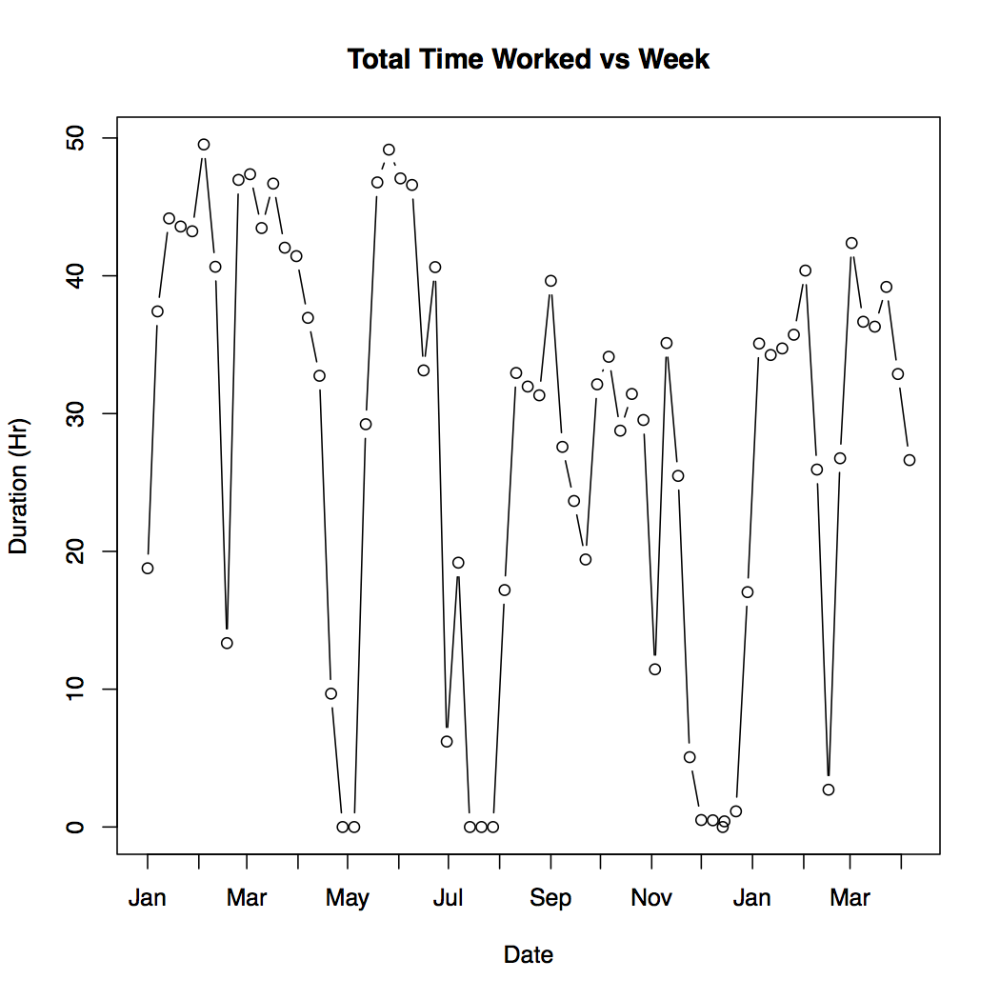
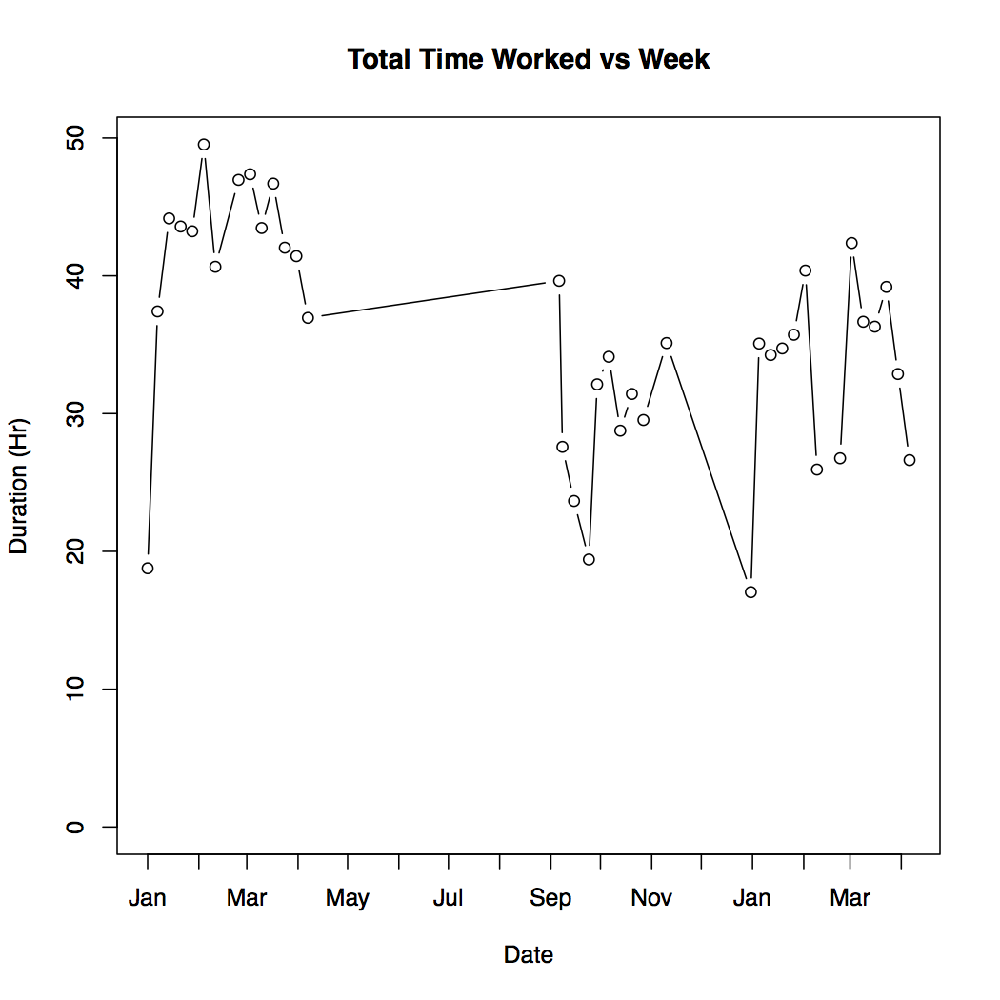
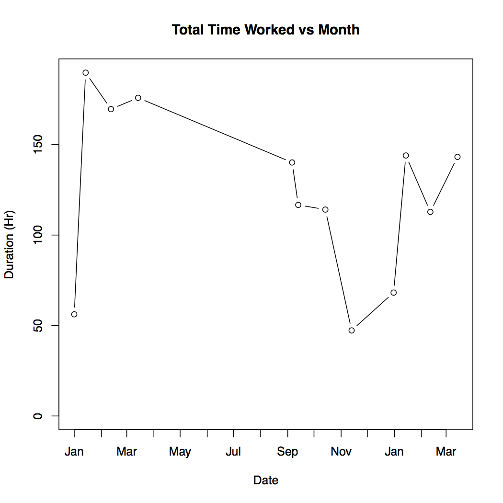
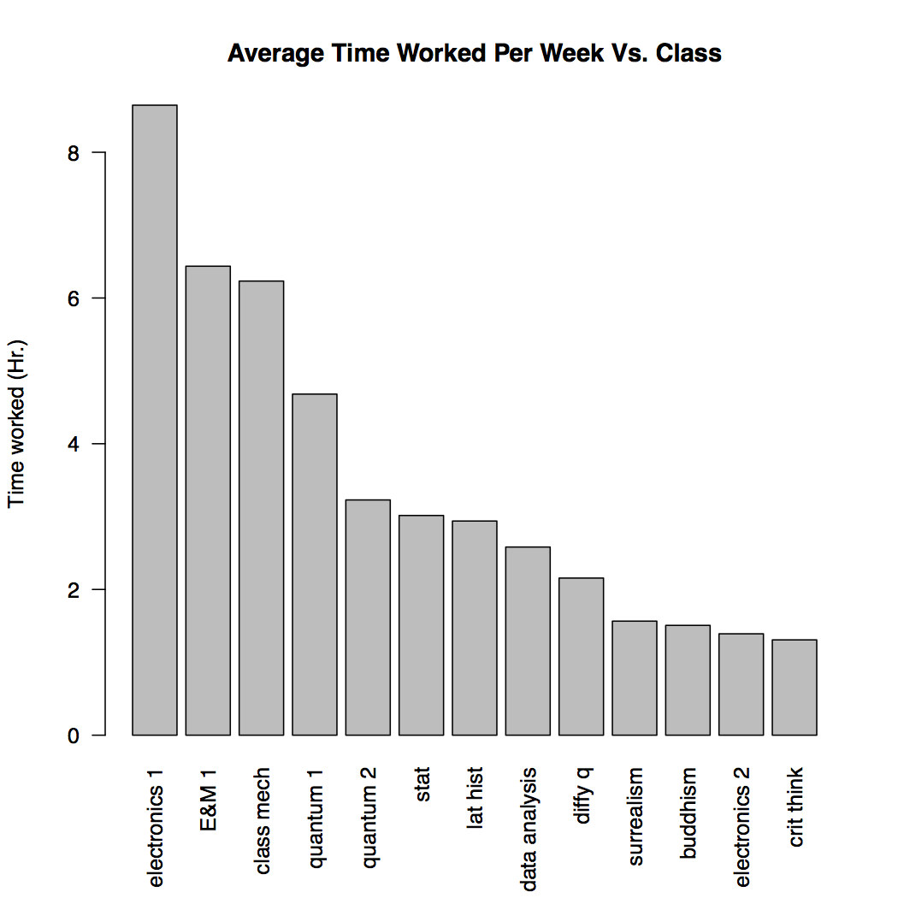
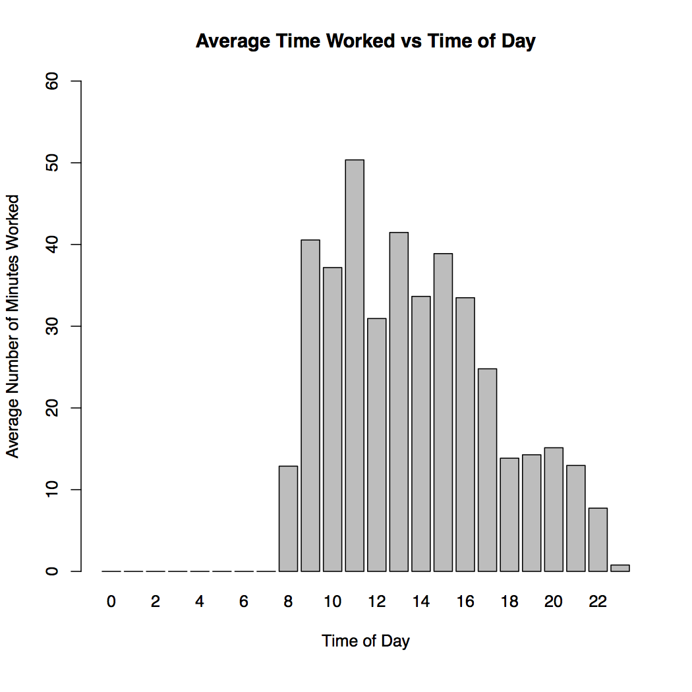
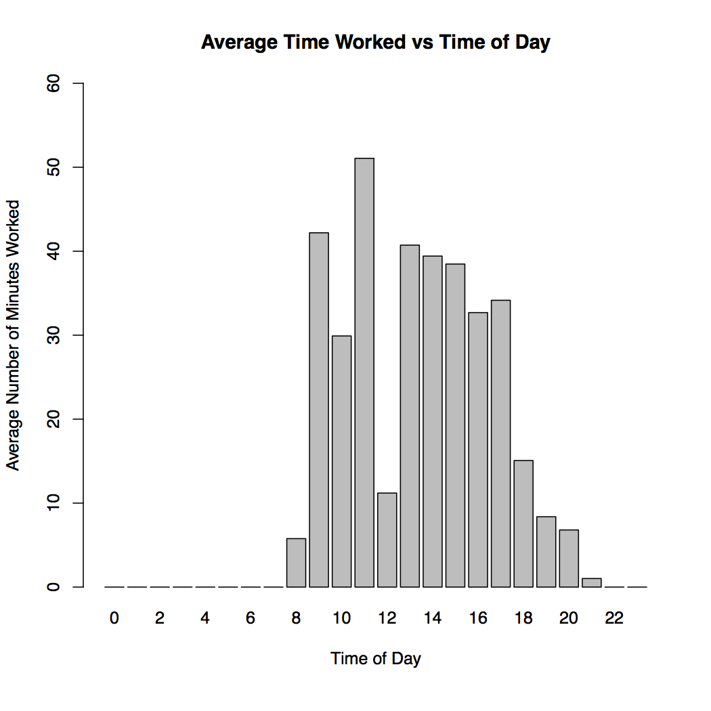

# Three Semesters, by the numbers

##An adventure in time tracking

## Intro

I started really time tracking the first semester of my sophomore year[^1]. I had played with time tracking before that, but only when I was feeling particularly desperate.  Half way through that fall semester through a confluence of factors came together, and showed me that I really needed to get a better grasp on the time I was spending on every aspect of school. 

I originally intended to just track my time for a couple weeks, maybe a month, but it turned into a lot more than that. It's now the summer after my Junior year and I have been tracking my school work, along with other aspects of my life, religiously for well over a year. With this wealth of data I decided I wanted to take a deeper dive into how I work.

I use [Toggl](https://toggl.com/) for my time tracking. I'm happy with it, and it gives basic good analysis and visualization for short time periods. It can't do what I want though[^2]. Luckily it allows you to export your data into a CSV, so the only limit is your imagination (and coding ability). I choose to perform my analysis in R. If you want spoilers for this post you can find my code on [GitHub](https://github.com/WLaney/Toggl_Three_Semesters_Analysis)[^3]. 

One note before we get going, I am only looking at my school work for this post. That means courses, and academic research. Over the years I have played with tracking other aspects of my life, from cooking and cleaning, to time spent with my fraternity, but none for as long or as rigorously as my school work.

## Initial views of the data

### (Or I'm working to hard and also not hard enough)

I started by making a simple plot that shows the total number of hours I worked each week from the beginning of the Spring 2016 semester to the end of the Spring 2017 semester. This is the full time span I am examining in this analysis (I started time tracking in the middle of the Fall 2015, but I am excluding that since it is not a full semester). I expected it to show my doing progressively less school work each semester. That is what I perceived on the ground, and it's reflected in the number of credit hours I took.



That is kinda a mess. The big downward spikes in the data come from breaks taken during and between the semester. It seems that the average work per week during the Spring 2016 semester may be higher, but it is hard to tell. Plotting the total hours worked by month instead of week does not do much to smooth this out.


The next step I took was to just remove the  breaks and vacations from the data. I'm concerned with my work while at school and in classes, so data taken during breaks is not important.





This is looking a lot better[^4]. Now I'm starting to get a feel for how my work load shifted between semesters. It is also  clear that I did more hours of work on an average week in Spring 2016 than Fall 2016 or Spring 2017. To nail this down a little better I isolated the three semester and calculate statistics for each[^5].

|             | mean  | median | sd   | max   | min   |
| ----------- | ----- | ------ | ---- | ----- | ----- |
| Spring 2016 | 41.59 | 43.35  | 7.49 | 49.53 | 18.78 |
| Fall 2016   | 30.14 | 30.48  | 5.80 | 39.67 | 19.41 |
| Spring 2017 | 33.14 | 34.91  | 6.82 | 42.38 | 17.04 |

Now I'm going to go on a little digression and defend myself. I can already feel people looking at these numbers and thinking "These lazy college students, that's no work at all. I've been working 80 hours a week, uphill both ways in the snow for years!" and that very well might be true for some people. For a lot of people though I think they are comparing apples and oranges.

These times represent the number of hours I spent really working, nose to the grindstone, on mostly technical work. There is no time spent on email in this, I track that separate from school work. There are no useless meeting in this, the closest thing to a meeting is class where I have to be actively taking in depth notes. There is no ideally socialising with friends while sitting in the library pretending to do homework, I don't count that time. I don't even count the time that I'm actually talking to classmates about how to solve a problem. If I check facebook or respond to a text, or someone swings by my room to chat I stop the clock.

This is just not how I think people look at time spent working in office environments. In my experience (3 or 4 internships between government and private industry) people spend a lot of their time in meetings, or responding to emails of widely varying importance, or talking to coworkers. They do not spend all 40 hours a week writing reports, or reading academic texts, or writing code, or solving math problems. This is not to say they should either, or that most people only REALLY work 20 hours a week, or whatever. I am simply trying to say that I am tracking school work for this project in a very rigid way that does not reflect the way most people seem to think of time worked outside of college (or even in college). So I caution comparing these numbers to the hours you are putting in at your job.

This touches on one of the most interesting takeaways for my life though. I spend a lot longer "working" then I do working. We will see this more clearly in [the daily cyles](#the-daily-cycles) section, but from these graphs I know that for every hour I'm at a desk claiming to be working, I am only actually working for 1/2 or 3/4th of that time. I don't know if I should find that troubling or not, but it is interesting.

Before we get to that though I want to break this data down by classes and see if I can find relations between this time and something on my transcript.

## Classes and correlations

### (Or everything is a lie)

Time on coursework is not a zero sum game. Spending more time on  coursework does not necessarily lead to better grades.  Spending the same amount of time on coursework, but allocating it differently can [^6].

This idea is part of what brought me to time tracking to begin with. As you'll see in a moment though, I did a very poor job of implementing it in my life.

Here is a plot of the average time I spent on each class per week over the three semesters:[^7]



Here is a quick break down of my schedule per semester, excluding independent research:

* Spring 2016
  * Electronics I
  * Classical Mechanics
  * Differential Equations
  * Latin American History Since 1824
  * Critical Thinking
* Fall 2016
  * Electronics II
  * Quantum I
  * Intro Buddhism
  * Prob & Stat for Scientists
* Spring 2017
  * Quantum II
  * E&M I
  * Statistical Data Analysis
  * Surrealism to High Modernism (Pass/Fail)

The first thing I notice looking at this plot is that the class I spent the most time on per week was electronics I by a fair margin. This is upsetting when you consider that Electronics I is a 2 credit hour lab class, and most of the rest of the list is 3-4 credit hour lectures. Also keep in mind that the number you see does not take into account the actual time I spent in class/lab. I tracked that as classroom time, this is just the time I spent on homework.

This is a problem with the class. They need to change the amount of work associated with it, it is a lot of time for not much GPA effect. It does point to a larger phenomenon though; credit hours don't mean anything. In my data there is no correlation between credit hours and time spent per week on a class.

```
> #time and credit hours
> cor.test(all_classes[,1],all_classes[,7], use="complete.obs")

	Pearson's product-moment correlation

data:  all_classes[, 1] and all_classes[, 7]
t = -0.070407, df = 11, p-value = 0.9451
alternative hypothesis: true correlation is not equal to 0
95 percent confidence interval:
 -0.5655949  0.5360300
sample estimates:
        cor 
-0.02122362 
```

This is a little surprising, considering the point of credit hours is to tell you how much work a class is. Keep in mind here though that this is a small sample size from one college. I would love to hear if other people feel that credit hours mean anything at their school[^8].

While I was looking at correlation I decided to try a few other things out. First time per week vs grade

```
> #time and grade
> cor.test(all_classes[,1],all_classes[,6], use="complete.obs")

	Pearson's product-moment correlation

data:  all_classes[, 1] and all_classes[, 6]
t = 1.435, df = 10, p-value = 0.1818
alternative hypothesis: true correlation is not equal to 0
95 percent confidence interval:
 -0.2106143  0.7979082
sample estimates:
     cor 
0.413236 
```

Nope, no correlation there.

What about credit hours multiplied by grade? This is an important metric on my transcript and it makes sense. You should spend more time for more credit hours, and more time for a higher grade.

```
> #time and quanlity pt
> cor.test(all_classes[,1],all_classes[,8], use="complete.obs")

	Pearson's product-moment correlation

data:  all_classes[, 1] and all_classes[, 8]
t = 0.75732, df = 10, p-value = 0.4663
alternative hypothesis: true correlation is not equal to 0
95 percent confidence interval:
 -0.3936124  0.7116777
sample estimates:
      cor 
0.2329001 
```

No correlation here either.

It seems like nothing on my transcript is a good indicator of how much time I spent on a class.

Before we move on to the next section, some one you might be noticing a more qualitative conclusion from the this section: I spend more time on math and science classes then liberal arts classes. Some of my classmates would say this shows that math and science is harder than liberal arts. I don't believe that, and this is not a good comparison. All the math and science on that list are upper level courses, while the liberal arts are more entry level.

##The daily cycles

###(Or how do you even judge work?)

The last part of the data I'm looking at is when I'm working. This was by far the hardest part of the code to write, and I'm still not sure if what I'm looking at really makes sense. It is interesting though. Here is plot, and then I'll walk through what it means:

#### Spring 2016



This plot shows the average time, in minutes, I worked each hour on weekdays when I had class. The idea behind this is to show me when I get work done, and how efficiently[^9]I work throughout the day.

What it more directly shows is my class schedule. I know that though, and can take it into account when analysing the plots.

Here is the same plot for the next two semesters.

#### Fall 2016


#### Spring 2017



I don't have the exact same schedule every semester, but Fall 2016 and Spring 2017 were very similar.

This shows me that I take a lot of breaks while I work. For every hour during my "working day" I am only really doing 40 minutes of work at best. Often it's a lot less than that. This means that I take pretty constant breaks. I don't think this sort of thing is uncommon though, and it is actually pretty necessary for high intensity thinking.

These plots also show that how I perceive my day is wrong. I feel that I do most of my work in the first couple hours of the day, between when I wake up and go to my first class (normally at 11). Then I think I go to classes, eat lunch, have more classes, do a little work in the afternoon, and my day is done. This however shows that I am spending a lot more time in the afternoon working than I thought. It also shows that maybe I don't work as much in the morning. It seems that between 10 and 11 I only work for on average half an hour, but I feel that from 9 to 11 is my most productive time.

This brings us to the elephant in the room for time tracking[^10]. Time worked is not a great proxy for productivity. Even though I don't work as much in the morning as the afternoon, I still believe that the morning is my most productive time. I turn out higher quality work in the morning, and I do it more efficiently. Time tracking can't show me that though. It shows how long I worked, not how much I got done, and not how good that work is. These day plots are a perfect example of that.

## Conclusion

I'm sure I can think of more ways to slice and dice this data, and people are probably screaming some at their computer monitors right now, but this feels like more than enough. I had a lot of fun doing this analysis and pulling all this together, but I'm not sure I found the shocking insights I was hoping for. Mostly this project has helped me quantify and examine things I already knew, or at least felt, were true. That is useful though. Any sort of self reflection is important. 

I also hope that this will help you think a little bit more clearly about your work. Even if you don't go off the deep end with time tracking it's important to think about time. Time is one of the only constants we have. 

Finally for those brave souls who do want to follow in my footsteps, I wish you luck. Make sure to let me know what you discover :)

------

#### About the Author:

William Laney is a physics major at The College of William & Mary, graduating in January 2018. Toggl says he spent a little more than 26hrs over the past 5 months putting all this together.

Feel free to follow him on Twitter [@iamwill2](https://twitter.com/iamwilltwo), or shoot him an email at iamwilltwo[@]gmail.com

[^1]: [Before it was cool](https://youtu.be/x28ZZcdsv1A?t=7m33s)
[^2]: I have not tried out the new "Insights" feature that may do what I want. I use the free version of the service. Insights seems more geared towards business than the type of analysis I want to perform though.
[^3]: I started out by trying to write the code in general functions that would be easy for other people to use, but I quickly gave up on that. I ended up writing code that just generalizes to the specific way I use toggle. Hopefully someone can find it useful though :)
[^4]: The long horizontal line is an artifact from removing summer vacation. If I were to make these plots again I would have just put a discontinuity there, but right now I would rather have this post written then tinker more with the code.
[^5]: If it wasn't clear already the decimals are fractions of an hour, not minutes. So 1.50 would be 1 hour and 30 minutes, not 1 hour and 50 minutes.
[^6]: I think there are more important things to consider than grade when reflecting on classes and time allocation. The problem is that this is a quantitative analysis and grades are the only quantitative measure I have.
[^7]: For those of you trying to reverse my numbers from this section to the last one, you're going have a hard time. I am excluding independent research from this, where I included it in the last part. The reason is that at my school independent research is set up and evaluated based on a system where credit hours correspond to a set amount of time to work per week. So you work the same amount of time every week no matter what. I'm also excluding time in class, because that is fixed as well.
[^8]: I bet they don't
[^9]: efficiency in this case being the number of minutes in a given hour that I'm working
[^10]: If there is actually an elephant in your room, please don't touch it